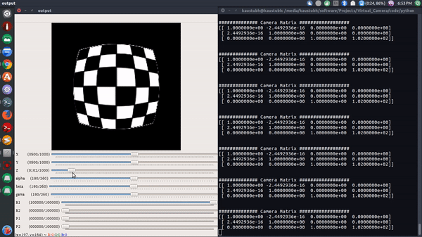
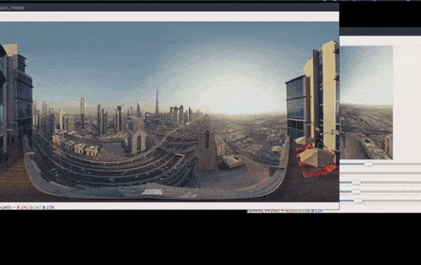
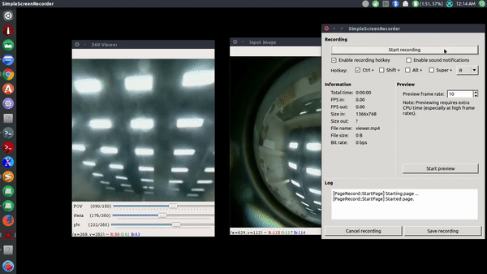
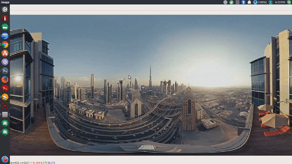
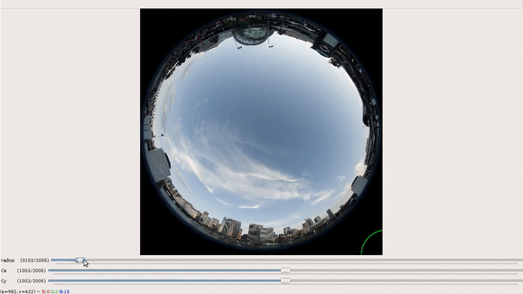
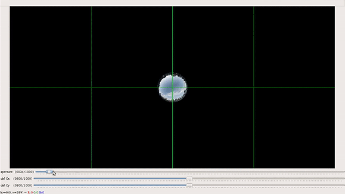
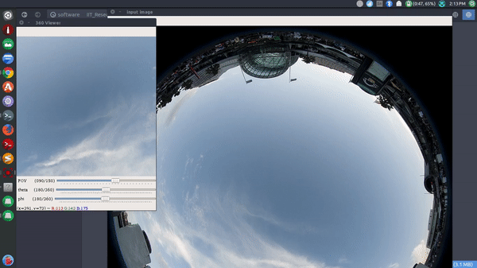
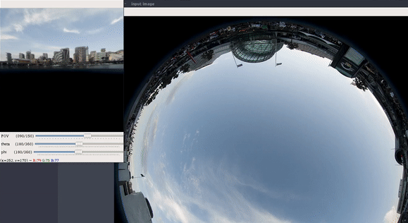

# OmniCV-Lib - Library for omnidirectional cameras

## Project in brief

As part of my research related to perception algorithms for omnidirectional cameras, I studied and implemented the following mathematical models for omnidirectional cameras:

* Pinhole Camera Model
* Brown–Conrady model
* Unified Camera Model
* Extended Unified Camera Model
* Kannala-Brandt Camera Model
* Field-of-View Camera Model
* Double Sphere Camera Model

Combining these implementations with functions for interconversion of different representations of 360-degree images, like cubmap, equirectangular, fisheye, and perspective view, I created a library called **OmniCV**.

[**Documentation of OmniCV Library is available here**](https://kaustubh-sadekar.github.io/OmniCV-Lib/index.html)

The idea here was to use the inverse projection function (Unprojection function) to determine the real-world coordinate direction, get corresponding spheric coordinates for a unit sphere and sample the pixel values from a given 360&deg; image (in equirectangular format).

  

  GUI for pinhole camera with Brown–Conrady model

  

  GUI for unified camera model

## 360° video streaming and viewing GUI for omnidirectional camera

This application is created using the functions provided in the OmniCV library. It is a 360&deg; video player.
Some key points of the application are mentioned below :

* Real-time streaming using an omnidirectional camera.
* Flask server to transform the frame from the stream and provide 360° pan view.
* App interface to view the 360° video with a GUI that enables the user to pan the view.
* Software supports horizontal as well as the vertical orientation of the streaming camera.

  

  Example of 360&deg; viewing GUI

## Output Gallery

Some interesting 360&deg; video effects

Arround the world effect             |  Hollow world effect 
:-------------------------:|:-------------------------:
  |  

Creating custom fisheye images 

Equirect2Fisheye             |  Custom image using GUI 
:-------------------------:|:-------------------------:
  |  

GUI to determine fisheye camera parameters

GUI to get radius        |  GUI to get fisheye params
:-------------------------:|:-------------------------:
  |  

Horizontal and vertical orientation viewing mode support

360&deg; viewer mode 1        |  360&deg; viewer mode 2
:-------------------------:|:-------------------------:
  |  

*Project page template inspired from [GradSLAM](https://gradslam.github.io/).*
